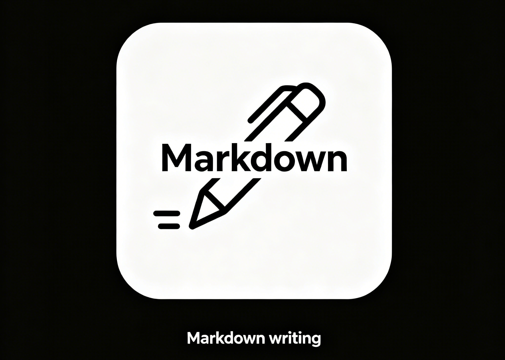

<p align="center">
  
</p>

# Markdown writing

一款所见即所得的 Markdown 编辑器，灵感来自 Typora 和 Effie。

## 功能特点

- **所见即所得** — 输入 `#` + 回车，即渲染为标题样式
- **源码模式** — `Cmd+/` 切换为 Markdown 源码编辑，支持语法高亮
- **专注模式** — `Cmd+Shift+F` 高亮当前段落，其余内容变暗
- **打字机模式** — `Cmd+Shift+T` 光标始终保持在屏幕中央
- **文件管理** — 侧边栏浏览本地文件夹，右键新建/删除文件
- **大纲视图** — 实时提取标题结构，点击快速跳转
- **主题切换** — 浅色 / 深色 / 暖色三种配色
- **图片粘贴** — `Cmd+V` 粘贴剪贴板图片，支持拖拽上传
- **导出** — 支持导出 PDF 和 HTML

## 技术栈

| 层级 | 技术 |
|------|------|
| 桌面框架 | Electron + electron-vite |
| 编辑器引擎 | TipTap (ProseMirror) |
| 源码编辑 | CodeMirror 6 |
| 界面 | React 19 + Tailwind CSS |
| 状态管理 | Zustand |
| 导出 | markdown-it |

## 开发

```bash
# 安装依赖
npm install

# 启动开发服务器（热更新）
npm run dev

# 生产构建
npm run build
```

## 打包

```bash
# 打包为桌面应用（macOS / Windows / Linux）
npm run package
```

打包配置见 `electron-builder.yml`，应用图标位于 `resources/` 目录。打包产物输出至 `dist/` 目录。

## 项目结构

```
src/
├── main/          # Electron 主进程（窗口、菜单、IPC）
│   ├── ipc/       # 文件、导出、对话框处理
│   └── services/  # 文件读写、导出管道
├── preload/       # 预加载脚本（contextBridge）
├── renderer/      # React 渲染进程
│   ├── components/
│   │   ├── editor/      # 编辑器核心、源码模式
│   │   ├── sidebar/     # 侧边栏、文件树、大纲
│   │   ├── settings/    # 设置页面
│   │   └── layout/      # 状态栏
│   ├── hooks/           # 自动保存、菜单事件
│   ├── stores/          # Zustand 状态
│   └── lib/             # TipTap扩展、markdown解析
└── shared/        # IPC通道、默认配置
```

## 许可证

MIT
